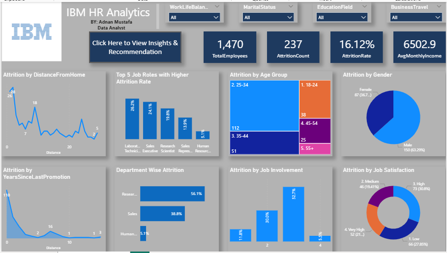
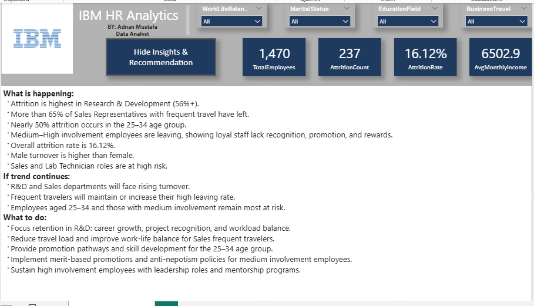

# IBM HR Analytics — Employee Attrition Analysis


## Dashboard Preview

### Core Analytics Interface


### Dynamic Insights Panel


> **Transforming raw HR metrics into corporate strategy — a complete business intelligence pipeline analyzing employee attrition across 1,470 personnel records.**

---

## Project Overview

This project delivers an end-to-end data analytics pipeline focused on workforce retention, using the **IBM HR Employee Attrition & Performance dataset** from Kaggle. The pipeline covers structured SQL ingestion, star schema warehousing, and an executive-level HR dashboard with a dynamic bookmark toggle.

The goal was to move past basic charts and design a workflow mimicking an enterprise corporate environment. Raw data was systematically structured inside a MySQL relational model, ensuring structural integrity before implementing advanced DAX measures in Power BI.

---

## Business Questions Answered

- What is the organization's overall attrition rate, and which departments are most affected?
- Which job roles face the highest turnover risk?
- Is there a correlation between business travel frequency and employee attrition?
- How do job involvement, satisfaction, and work-life balance drive departures?
- Which employee age groups are most at risk of leaving?
- What operational changes should leadership implement to curb talent loss?

---

## Tools & Technologies

| Layer | Tool |
|-------|------|
| Data Source | Kaggle CSV (IBM HR Dataset) |
| Relational Storage | MySQL Workbench |
| Data Warehousing | Star Schema (Dimension & Fact Tables) |
| Business Intelligence | Microsoft Power BI |
| Semantic Layer | DAX Measures |

---

## Project Architecture

```
Kaggle HR Dataset (CSV)
        ↓
MySQL — Schema Creation, Table Ingestion & Star Schema Design
        ↓
Power BI — Semantic Modeling, DAX Measures & Dashboard
        ↓
Executive Insights Panel (Interactive Bookmark Toggle)
```

---

## Phase 1: Database Engineering (MySQL)

### Structural Normalization

The raw flat CSV was systematically normalized into an optimized Star Schema layout using SQL scripts. Three redundant zero-variance system columns were dropped at the schema level: `EmployeeCount`, `Over18`, and `StandardHours`. These columns held identical values across all 1,470 records and contributed no analytical value.

`EmployeeNumber` was mapped as the primary key across both tables to ensure referential integrity.

### Star Schema Design

```
┌────────────────────────────────────────────────────────┐
│                    Employee_Lookup                      │
│  (EmployeeID, Age, AgeGroup, Gender, MaritalStatus,    │
│   Education, Department, JobRole, BusinessTravel,      │
│   DistanceFromHome)                                     │
└───────────────────────────┬────────────────────────────┘
                            │ 1
                            │
                            │ *
┌───────────────────────────┴────────────────────────────┐
│                     Fact_Attrition                      │
│  (EmployeeID, Attrition, AttritionCount, MonthlyIncome,│
│   JobLevel, JobInvolvement, JobSatisfaction,           │
│   WorkLifeBalance, EnvironmentSatisfaction,            │
│   YearsAtCompany, YearsSinceLastPromotion, OverTime)   │
└────────────────────────────────────────────────────────┘
```

**Employee_Lookup (Dimension Table):** Captures individual demographics and structural attributes. Continuous integer fields such as Age were categorized into logical groups (18-24, 25-34, 35-44, 45-54, 55+) using server-side CASE statements to optimize dashboard slicer performance.

**Fact_Attrition (Fact Table):** Houses numeric tracking flags, behavioral scores, and compensation data. Satisfaction metrics (1 to 4) were mapped to descriptive text labels (Low, Medium, High, Very High) to build intuitive slicers.

---

## Phase 2: Power BI Semantic Modeling & DAX

### Data Model

The two tables are connected via a strict One-to-Many relationship:
`Employee_Lookup[EmployeeID]` → `Fact_Attrition[EmployeeID]`

### DAX Measures

```dax
Total Employees = DISTINCTCOUNT(Employee_Lookup[EmployeeID])

AttritionCount = SUM(Fact_Attrition[AttritionCount])

AttritionRate = DIVIDE([AttritionCount], [Total Employees], 0)

AvgMonthlyIncome = AVERAGE(Fact_Attrition[MonthlyIncome])

AllAttrition = CALCULATE([AttritionCount], ALL(Fact_Attrition))

%OfTotalAttrition = DIVIDE([AttritionCount], [AllAttrition], 0)
```

### Dashboard Visuals

- KPI Cards: Total Employees, Attrition Count, Attrition Rate, Avg Monthly Income
- Attrition by Age Group (Treemap)
- Attrition by Department (Bar Chart)
- Attrition by Gender (Donut Chart)
- Top 5 Job Roles by Attrition Rate (Bar Chart)
- Attrition by Job Involvement (Bar Chart)
- Attrition by Job Satisfaction (Donut Chart)
- Attrition by Distance From Home (Line Chart)
- Attrition by Years Since Last Promotion (Line Chart)
- Slicers: Work-Life Balance, Marital Status, Education Field, Business Travel

### Interactive Insights Toggle

To preserve canvas space while delivering diagnostic value, the dashboard features a built-in bookmark toggle.

- Clicking **"Click Here to View Insights & Recommendation"** replaces active charts with a full strategic analysis overlay.
- Clicking **"Hide Insights"** resets the canvas back to the standard metric view.

This feature was built using Power BI Bookmarks and the Selection pane, a technique commonly used in professional BI reporting.

---

## Key Insights & Recommendations

### Descriptive — What Happened?
The organization has an overall attrition rate of **16.12%**, losing **237 out of 1,470** total employees. Research & Development accounts for **56.1%** of all departures. Laboratory Technicians, Sales Executives, and Research Scientists represent the highest attrition volume. Male turnover is higher at **63.29%**.

### Diagnostic — Why Did It Happen?
Nearly **50% of attrition** is concentrated in the **25-34 age group**, pointing to early-career dissatisfaction. Employees with medium-high job involvement are actively resigning, showing that loyal, hard-working staff feel unrewarded. Sales roles with frequent travel show a **65%+ turnover spike**, confirming that poor work-life balance is driving out revenue generators.

### Predictive — What Will Happen?
If left unmanaged, R&D will experience compounding loss of specialized skill sets, impacting long-term project delivery. Sales teams will face continuous revenue pipeline disruption. The organization risks losing its future leadership pipeline as high-performing individuals in the 25-34 demographic continue to exit.

### Prescriptive — What Should Be Done?
- **R&D Retention:** Establish career growth pathways, project recognition milestones, and workload rebalancing inside R&D.
- **Travel Fatigue:** Cap monthly travel for high-frequency Sales Representatives and introduce hybrid field setups.
- **Demographic Fast-Tracking:** Introduce structured promotion pathways for the 25-34 age segment.
- **Meritocracy Audits:** Implement transparent, performance-tied promotion reviews to rebuild trust among mid-level employees.
- **High-Involvement Mentorship:** Move high-performing at-risk employees into leadership development roles to secure organizational retention.

---

## Project Structure

```
IBM-HR-Attrition-Analytics/
│
├── sql/
│   └── IBM_HR_Database.sql          # Schema creation & star schema scripts
│
├── powerbi/
│   └── IBM_HR_Dashboard.zip         # Password-protected Power BI file
│
├── assets/
│   ├── dashboard_overview.png       # Core dashboard interface
│   └── dashboard_insights.png       # Insights panel view
│
└── README.md
```

---

## Project File Security Note

The Power BI `.pbix` file has been uploaded as a password-protected ZIP inside the `powerbi/` directory to protect the dashboard design and DAX architecture.

**For Hiring Managers & Recruiters:** To inspect the complete data model, DAX measures, and dashboard configurations, please send a direct message on **[LinkedIn](https://www.linkedin.com/in/adnan-mustafa-jopo/)** to request the extraction password.

---

## How to Reproduce

1. Download the dataset from [Kaggle — IBM HR Analytics](https://www.kaggle.com/datasets/pavansubhasht/ibm-hr-analytics-attrition-dataset)
2. Execute `sql/IBM_HR_Database.sql` in MySQL Workbench to create the database and tables
3. Connect Power BI Desktop to your MySQL instance
4. Request the ZIP password via LinkedIn and extract `powerbi/IBM_HR_Dashboard.zip`
5. Open the `.pbix` file to inspect the full model and DAX measures

---

## Author

**Adnan Mustafa**
Data Analyst
[LinkedIn](https://www.linkedin.com/in/adnan-mustafa-jopo/)

---

## Dataset Source

- **Name:** IBM HR Analytics Employee Attrition & Performance
- **Source:** [Kaggle](https://www.kaggle.com/datasets/pavansubhasht/ibm-hr-analytics-attrition-dataset)
- **License:** Public Domain (CC0)
